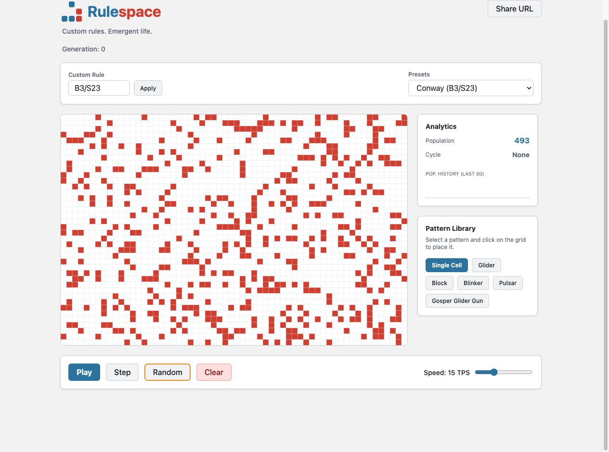
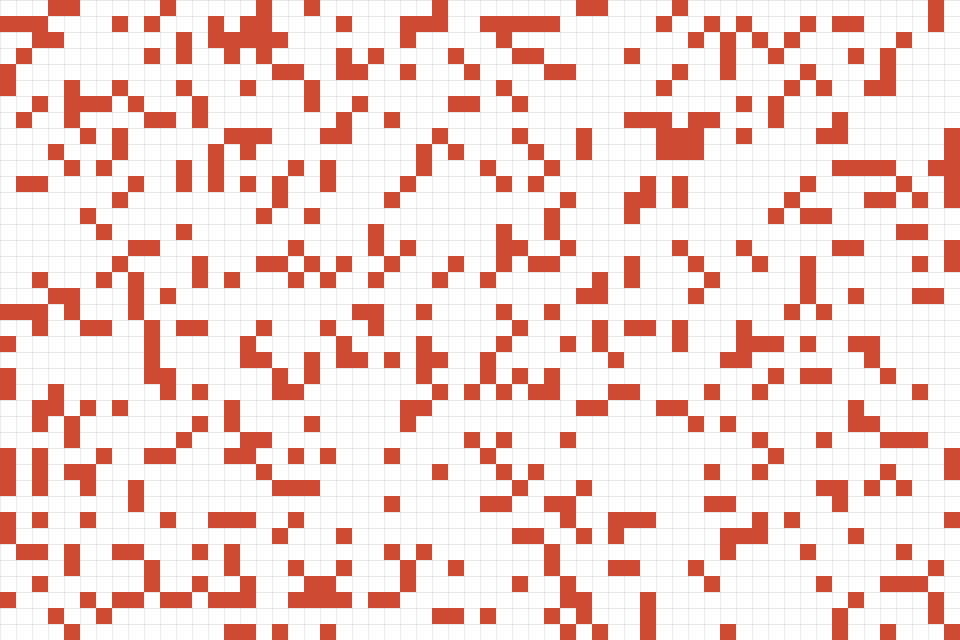

<div align="center">
  <picture>
    <source media="(prefers-color-scheme: dark)" srcset="src/assets/rulespace-logo-lockup-dark.svg">
    
  </picture>
  <p><b>Custom rules. Emergent life.</b></p>
  
  <p>An interactive, high-performance Conway's Game of Life sandbox built with React, TypeScript, and Canvas 2D.</p>
</div>

---

## 🎬 Release Preview

<table>
  <tr>
    <td width="50%" align="center">
      
    </td>
    <td width="50%" align="center">
      
    </td>
  </tr>
  <tr>
    <td align="center"><sub>Interactive sandbox</sub></td>
    <td align="center"><sub>Simulation in motion</sub></td>
  </tr>
</table>

## 🚀 Features

- **Custom Rules**: Edit the rules of life on the fly using standard `B/S` notation (e.g., Conway's `B3/S23`, HighLife `B36/S23`, Day & Night `B3678/S34678`).
- **Pattern Library**: Click-to-place integration of famous patterns like the Gosper Glider Gun, Pulsar, and more.
- **Analytics**: Real-time population tracking, graphing, and infinite cycle detection.
- **URL Sharing**: Share interesting states instantly via URL-safe Base64 query parameters.
- **High Performance**: Toroidal array-backed grid simulation optimized for consistent 60fps rendering.

## 🏗️ Architecture

Rulespace strictly separates concerns to maintain high performance and clean code:

1. **Engine (`src/engine/`)**: Pure TypeScript, zero DOM dependencies. Handles the Toroidal Grid operations, B/S rule parsing, and step simulation logic. Unit tested via Vitest.
2. **Renderer (`src/components/Renderer/`)**: React wrapper for HTML Canvas. Uses `requestAnimationFrame` for efficient drawing.
3. **UI (`src/components/`)**: React components for play controls, stats, pattern selection, and rule input.
4. **Codec (`src/codec/`)**: Fast, validated simplified RLE (Run Length Encoding) mechanism that compresses grid state into URL-safe Base64 strings for query parameters. It intentionally supports Rulespace's raw `b`/`o`/`$`/`!` format only, not standard RLE headers or comments.

## 🧭 Architecture Decisions

- **Keep the simulation pure.** The engine has no React or DOM dependency, so rules, wrapping behavior, analytics, and cycle detection can be tested independently of the interface.
- **Render cells with Canvas, not DOM nodes.** A single canvas avoids creating thousands of React elements and keeps the renderer focused on drawing the current grid.
- **Prefer bounded, verified cycle detection.** The app remembers the most recent 50 states, uses hashes to narrow candidates, then compares grid bytes to avoid hash-collision false positives.
- **Make sharing static and durable.** State lives in a URL-safe query parameter, keeping the project deployable on GitHub Pages without a backend or account system.

## 💻 Development

```bash
# Clone the repository
git clone https://github.com/turhancan97/rulespace.git
cd rulespace

# Install dependencies
npm install

# Run the local development server
npm run dev

# Run the vitest test suite
npm run test
```

## 🌐 Deployment

This project is configured to automatically deploy to **GitHub Pages** via GitHub Actions upon any push to the `main` branch.

The Vite configuration includes a `base: '/rulespace/'` path to correctly resolve assets on the GitHub Pages subpath.

---
<div align="center">
  <sub>Built by <a href="https://github.com/turhancan97">Turhan Can Kargin</a></sub>
</div>
